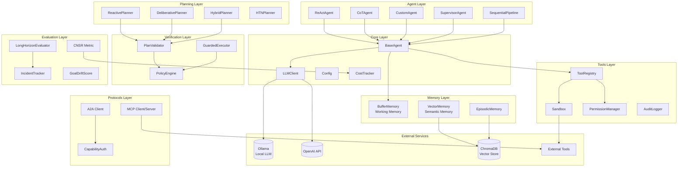
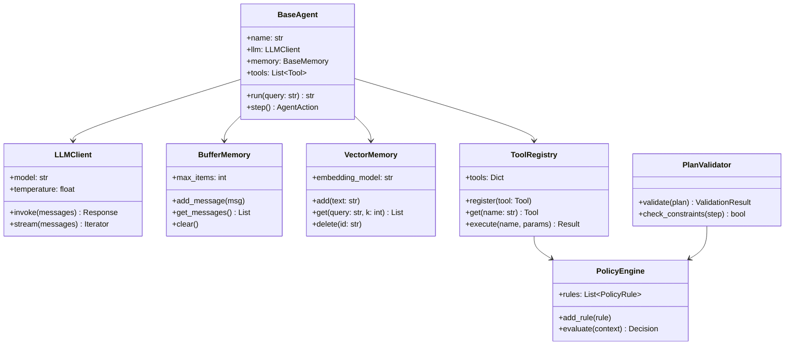
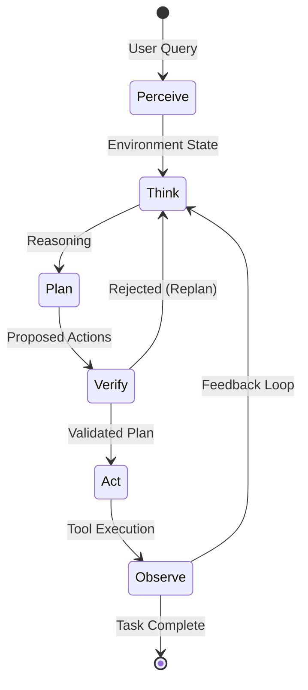

# Agentic AI Toolkit

[](https://opensource.org/licenses/MIT)
[](https://www.python.org/downloads/)

A comprehensive Python toolkit for building production-ready agentic AI systems. Features modular components for agent architectures, memory systems, tool integration, multi-agent coordination, and evaluation.

## Features

- **Agent Architectures**: ReAct, Chain-of-Thought, and custom agent patterns
- **Memory Systems**: Buffer memory (working memory) and vector memory (semantic long-term)
- **Tool Integration**: Flexible tool registry with schema validation and sandboxing
- **Multi-Agent Systems**: Sequential pipelines, supervisor patterns, and hierarchical orchestration
- **Protocol Support**: MCP (Model Context Protocol) and A2A (Agent-to-Agent) interfaces
- **Evaluation Framework**: Comprehensive metrics including CNSR, long-horizon evaluation
- **Observability**: Built-in tracing and monitoring with LangSmith support

## Installation

```bash
# Clone the repository
git clone https://github.com/MHHamdan/agentic-ai-toolkit.git
cd agentic-ai-toolkit

# Basic installation
pip install -e .

# With all optional dependencies
pip install -e ".[all]"

# Development installation
pip install -e ".[dev]"
```

## Quick Start

### Basic ReAct Agent

```python
from agentic_toolkit.core import LLMClient
from agentic_toolkit.agents import ReActAgent
from langchain_core.tools import tool

# Initialize LLM
llm = LLMClient(model="gpt-4o-mini", api_key="your-api-key")

# Define tools
@tool
def search(query: str) -> str:
    """Search for information."""
    return f"Results for: {query}"

@tool
def calculate(expression: str) -> str:
    """Evaluate a mathematical expression."""
    return str(eval(expression))

# Create agent
agent = ReActAgent(
    name="assistant",
    llm=llm,
    tools=[search, calculate],
    instructions="You are a helpful assistant that can search and calculate.",
)

# Run agent
result = agent.run("What is 25 * 4 and search for Python tutorials")
print(result)
```

### Memory Systems

```python
from agentic_toolkit.memory import BufferMemory, VectorMemory

# Working Memory: Short-term conversation buffer
buffer = BufferMemory(max_items=10)
buffer.add_user_message("Hello!")
buffer.add_ai_message("Hi there! How can I help?")
buffer.add_user_message("Tell me about AI agents")

# Get conversation history
history = buffer.get_messages()

# Long-term Semantic Memory: Vector store with embedding-based retrieval
vector_memory = VectorMemory(
    embedding_model="text-embedding-3-small",
    persist_directory="./memory_store"
)

# Store information
vector_memory.add("Python is a high-level programming language")
vector_memory.add("Machine learning is a subset of AI")
vector_memory.add("Neural networks are inspired by biological brains")

# Semantic retrieval
results = vector_memory.get("What programming languages are popular?", k=2)
for doc in results:
    print(doc.page_content)
```

### Multi-Agent Pipeline

```python
from agentic_toolkit.agents import SequentialPipeline, SupervisorAgent, ReActAgent

# Create specialized agents
researcher = ReActAgent(
    name="researcher",
    llm=llm,
    tools=[search_tool, web_scrape_tool],
    instructions="You research topics thoroughly."
)

analyst = ReActAgent(
    name="analyst",
    llm=llm,
    tools=[analyze_tool, summarize_tool],
    instructions="You analyze and synthesize information."
)

writer = ReActAgent(
    name="writer",
    llm=llm,
    tools=[format_tool],
    instructions="You write clear, well-structured content."
)

# Sequential Pipeline: Agents execute in order
pipeline = SequentialPipeline(
    name="content_pipeline",
    agents=[researcher, analyst, writer],
)
result = pipeline.run("Create a report on renewable energy trends")

# Supervisor Pattern: Central coordinator delegates to workers
supervisor = SupervisorAgent(
    name="coordinator",
    llm=llm,
    workers=[researcher, analyst, writer],
    instructions="Coordinate workers to complete complex tasks."
)
result = supervisor.run("Research and write about quantum computing")
```

### Evaluation

```python
from agentic_toolkit.evaluation import (
    calculate_cnsr,
    evaluate_agent,
    LongHorizonEvaluator,
)

# Cost-Normalized Success Rate (CNSR)
# Balances success against economic cost
cnsr = calculate_cnsr(
    successes=80,      # 80 successful tasks
    total_tasks=100,   # out of 100 total
    total_cost=50.0    # $50 total spend
)
print(f"CNSR: {cnsr}")  # Higher is better

# Comprehensive evaluation
result = evaluate_agent(successes=80, total_tasks=100, total_cost=50.0)
print(f"Success Rate: {result.success_rate:.2%}")
print(f"Mean Cost: ${result.mean_cost:.2f}")
print(f"CNSR: {result.cnsr:.2f}")

# Long-horizon evaluation for sustained operation
evaluator = LongHorizonEvaluator(window_size=50)
for task_result, cost in task_results:
    evaluator.record_task(success=task_result, cost=cost)

metrics = evaluator.get_metrics()
print(f"Rolling Success: {metrics['rolling_success'][-1]:.2%}")
print(f"Incident Rate: {metrics['incident_rate']:.2%}")
```

## Project Structure

```
agentic_ai_toolkit/
├── src/agentic_toolkit/
│   ├── __init__.py
│   ├── core/                    # Core components
│   │   ├── config.py            # Configuration management
│   │   ├── base_agent.py        # Base agent class
│   │   ├── llm_client.py        # Unified LLM interface
│   │   └── exceptions.py        # Custom exceptions
│   ├── agents/                  # Agent implementations
│   │   ├── react_agent.py       # ReAct agent
│   │   ├── cot_agent.py         # Chain-of-Thought agent
│   │   └── multi_agent.py       # Multi-agent systems
│   ├── memory/                  # Memory systems
│   │   ├── base_memory.py       # Memory interface
│   │   ├── buffer_memory.py     # Working memory
│   │   └── vector_memory.py     # Semantic long-term memory
│   ├── tools/                   # Tool integration
│   │   ├── base_tool.py         # Tool base class
│   │   ├── sandbox.py           # Sandboxed execution
│   │   └── tool_registry.py     # Tool management
│   ├── protocols/               # Communication protocols
│   │   ├── mcp/                 # Model Context Protocol
│   │   │   ├── client.py        # MCP client
│   │   │   ├── server.py        # MCP server (complete)
│   │   │   └── validation.py    # Request validation
│   │   └── a2a/                 # Agent-to-Agent Protocol
│   ├── evaluation/              # Evaluation framework
│   │   ├── metrics.py           # CNSR, success metrics
│   │   ├── goal_drift.py        # Goal drift detection
│   │   ├── incident_tracker.py  # Incident rate tracking
│   │   ├── rolling_metrics.py   # Rolling window analysis
│   │   └── long_horizon.py      # Long-horizon evaluator
│   ├── human_oversight/         # Human-in-the-loop
│   │   ├── approval_flow.py     # Approval requests
│   │   ├── escalation.py        # Escalation handling
│   │   └── audit.py             # Audit logging
│   ├── learning/                # Continuous learning
│   │   ├── deployment_loop.py   # Deployment cycle
│   │   ├── feedback.py          # Feedback collection
│   │   └── experience.py        # Experience replay
│   ├── planning/                # Planning components
│   │   └── planners.py          # Reactive, deliberative, hybrid
│   ├── verification/            # Plan verification
│   │   └── policy_engine.py     # Policy enforcement
│   └── utils/                   # Utilities
├── examples/                    # Example implementations
├── tests/                       # Test suite
│   ├── evaluation/              # Evaluation tests
│   ├── human_oversight/         # Oversight tests
│   ├── learning/                # Learning tests
│   └── integration/             # Integration tests
├── configs/                     # Configuration files
└── pyproject.toml               # Package configuration
```

## Configuration

### Environment Variables

Create a `.env` file or set environment variables:

```bash
# Required
OPENAI_API_KEY=sk-your-api-key

# Optional: Model configuration
LLM_MODEL=gpt-4o-mini
LLM_TEMPERATURE=0.1

# Optional: Observability
LANGSMITH_API_KEY=your-langsmith-key
LANGSMITH_PROJECT=my-project

# Optional: Alternative providers
ANTHROPIC_API_KEY=your-anthropic-key
```

### Programmatic Configuration

```python
from agentic_toolkit.core import Config, LLMConfig, MemoryConfig

config = Config(
    llm=LLMConfig(
        model="gpt-4o-mini",
        temperature=0.1,
        max_tokens=4096,
    ),
    memory=MemoryConfig(
        buffer_size=20,
        vector_collection="default",
    ),
)
```

## Architecture

### System Overview



### Component Architecture



### Control Loop



### ReAct Loop

The ReAct agent implements a Thought-Action-Observation loop:

1. **Thought**: Reason about current state and plan next action
2. **Action**: Execute a tool or generate response
3. **Observation**: Process action results
4. **Repeat**: Continue until task completion

### Memory Types

| Type | Purpose | Implementation |
|------|---------|----------------|
| Working Memory | Short-term conversation context | `BufferMemory` |
| Semantic Memory | Long-term knowledge storage | `VectorMemory` |
| Episodic Memory | Experience records | `VectorMemory` with metadata |

### Evaluation Metrics

| Metric | Description | Use Case |
|--------|-------------|----------|
| Success Rate | Task completion percentage | Basic performance |
| CNSR | Success normalized by cost | Cost-efficiency |
| Rolling Success | Windowed success over time | Temporal trends |
| Incident Rate | Safety events per task | Safety monitoring |
| Goal Drift | Objective deviation score | Long-horizon tasks |

### Long-Horizon Evaluation

```python
from agentic_toolkit.evaluation import LongHorizonEvaluator

# Comprehensive evaluation for sustained operation
evaluator = LongHorizonEvaluator(
    agent=my_agent,
    embed_fn=get_embedding,  # For goal drift tracking
    window_size=50,
    drift_threshold=0.3,
)

report = await evaluator.run_evaluation(
    tasks=task_list,
    original_goal="Complete all data processing tasks",
    checkpoint_interval=50,
)

print(f"CNSR: {report.cnsr:.3f}")
print(f"Goal Drift: {report.final_goal_drift:.3f}")
print(f"Incident Rate: {report.incident_rate_per_hour:.2f}/hour")
print(f"Recommendations: {report.recommendations}")
```

### Human Oversight

```python
from agentic_toolkit.human_oversight import ApprovalHandler, RiskLevel

# Setup approval handler
handler = ApprovalHandler(
    default_timeout=300,
    auto_reject_on_timeout=True,
)

# Create approval request for high-risk operation
request = handler.create_request(
    action="deploy_model",
    context={"model": "gpt-4", "environment": "production"},
    risk_level=RiskLevel.HIGH,
)

# Wait for human decision
result = await handler.wait_for_approval(request.request_id)
if result.approved:
    deploy_model()
```

### Deployment Loop

```python
from agentic_toolkit.learning import DeploymentLoop, DeploymentConfig

# Continuous deployment with learning
config = DeploymentConfig(
    evaluation_interval=100,
    rollback_threshold=0.6,
    enable_auto_rollback=True,
)

loop = DeploymentLoop(agent=my_agent, config=config)

async for update in loop.run(tasks=task_stream):
    if update.event_type == "evaluation":
        print(f"Success rate: {update.success_rate:.2%}")
    if update.event_type == "rollback":
        print(f"Rollback: {update.message}")
```

## Advanced Usage

### Custom Tools

```python
from langchain_core.tools import tool
from typing import List

@tool
def query_database(sql: str) -> List[dict]:
    """Execute a SQL query against the database.

    Args:
        sql: The SQL query to execute

    Returns:
        List of result rows as dictionaries
    """
    # Your database logic here
    return results

@tool
def send_email(to: str, subject: str, body: str) -> str:
    """Send an email.

    Args:
        to: Recipient email address
        subject: Email subject line
        body: Email body content

    Returns:
        Confirmation message
    """
    # Your email logic here
    return f"Email sent to {to}"
```

### Custom Agent

```python
from agentic_toolkit.core import BaseAgent

class CustomAgent(BaseAgent):
    """Custom agent with specialized behavior."""

    def __init__(self, name: str, llm: LLMClient, **kwargs):
        super().__init__(name=name, llm=llm, **kwargs)
        self.custom_state = {}

    def run(self, query: str, **kwargs) -> str:
        # Custom logic before execution
        self._preprocess(query)

        # Execute with base functionality
        result = super().run(query, **kwargs)

        # Custom logic after execution
        self._postprocess(result)

        return result

    def _preprocess(self, query: str):
        # Custom preprocessing
        pass

    def _postprocess(self, result: str):
        # Custom postprocessing
        pass
```

### Protocol Integration

```python
from agentic_toolkit.protocols.mcp import MCPClient
from agentic_toolkit.protocols.a2a import A2AClient, AgentCard

# MCP: Connect to external tool servers
mcp_client = MCPClient(server_url="http://localhost:8080")
tools = mcp_client.list_tools()
result = mcp_client.call_tool("search", {"query": "AI agents"})

# A2A: Agent-to-Agent communication
agent_card = AgentCard(
    name="my-agent",
    description="A helpful assistant",
    capabilities=["search", "summarize"],
    endpoint="http://localhost:9000"
)
a2a_client = A2AClient()
a2a_client.register(agent_card)
```

## Testing

```bash
# Run all tests
pytest

# Run with coverage
pytest --cov=agentic_toolkit

# Run specific test file
pytest tests/test_agents.py -v

# Run integration tests (requires API keys)
pytest tests/integration/ --run-integration
```

## Contributing

See [CONTRIBUTING.md](CONTRIBUTING.md) for guidelines.

## License

MIT License - see [LICENSE](LICENSE) for details.

## Acknowledgments

Built on top of:
- [LangChain](https://langchain.com/) and [LangGraph](https://langchain-ai.github.io/langgraph/)
- [OpenAI](https://openai.com/) and [Anthropic](https://anthropic.com/) APIs
- [ChromaDB](https://www.trychroma.com/) for vector storage
