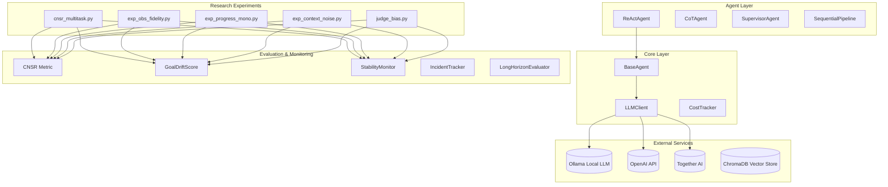
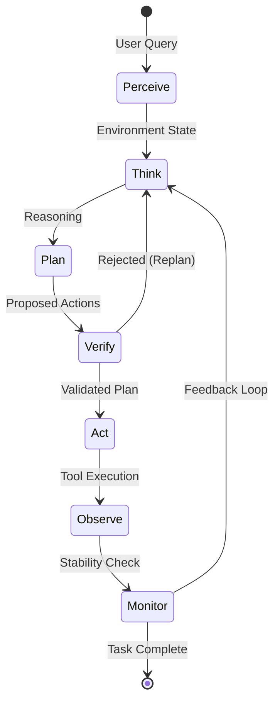

# Agentic AI Toolkit

[](https://opensource.org/licenses/MIT)
[](https://www.python.org/downloads/)
[](#testing)
[](pyproject.toml)

A comprehensive Python toolkit for building production-ready agentic AI systems. Features modular components for agent architectures, memory systems, tool integration, multi-agent coordination, evaluation, and a full suite of reproducible research experiments aligned with the paper *"Towards Autonomous Intelligence: A Survey of Agentic AI Systems"* (TAI-2025-Dec-R-02684).

<<<<<<< HEAD
A comprehensive Python toolkit for building production-ready agentic AI systems. Features modular components for agent architectures, memory systems, tool integration, multi-agent coordination, and evaluation.


=======

>>>>>>> 4aab772 (feat: add research experiments, eval shim, and README update (v1.1.0))

---

## Features

- **Agent Architectures**: ReAct, Chain-of-Thought, and custom agent patterns
- **Memory Systems**: Buffer memory (working memory) and vector memory (semantic long-term)
- **Tool Integration**: Flexible tool registry with schema validation and sandboxing
- **Multi-Agent Systems**: Sequential pipelines, supervisor patterns, and hierarchical orchestration
- **Protocol Support**: MCP (Model Context Protocol) and A2A (Agent-to-Agent) interfaces
- **Evaluation Framework**: CNSR, long-horizon evaluation, goal drift, incident tracking
- **Stability Monitoring**: Oscillation detection, progress monotonicity, observation fidelity
- **Research Experiments**: Full reproducible experiment suite (CNSR multi-task, Proposition 1 violations, LLM-as-Judge bias)
- **Observability**: Built-in tracing and monitoring with LangSmith support

---

## Installation

```bash
# Clone the repository
git clone https://github.com/MHHamdan/agentic-ai-toolkit.git
cd agentic-ai-toolkit

# Basic installation
pip install -e .

# With all optional dependencies (recommended)
pip install -e ".[all]"

# Research experiments only (no heavy LangChain deps needed)
pip install -e ".[experiments]"

# Development installation
pip install -e ".[dev]"
```

### Experiment dependencies

The experiments require:

```bash
pip install numpy scipy pandas litellm sentence-transformers
# litellm is optional — experiments fall back to seeded simulation on API errors
```

---

## Quick Start

### Basic ReAct Agent

```python
from agentic_toolkit.core import LLMClient
from agentic_toolkit.agents import ReActAgent
from langchain_core.tools import tool

llm = LLMClient(model="gpt-4o-mini", api_key="your-api-key")

@tool
def search(query: str) -> str:
    """Search for information."""
    return f"Results for: {query}"

@tool
def calculate(expression: str) -> str:
    """Evaluate a mathematical expression."""
    return str(eval(expression))

agent = ReActAgent(
    name="assistant",
    llm=llm,
    tools=[search, calculate],
    instructions="You are a helpful assistant that can search and calculate.",
)
result = agent.run("What is 25 * 4 and search for Python tutorials")
print(result)
```

### Evaluation — CNSR

```python
from agentic_toolkit.evaluation import calculate_cnsr, evaluate_agent

# Cost-Normalized Success Rate: Success Rate / Mean Cost per Task
cnsr = calculate_cnsr(successes=80, total_tasks=100, total_cost=50.0)
print(f"CNSR: {cnsr:.2f}")   # 1.60

result = evaluate_agent(successes=80, total_tasks=100, total_cost=50.0)
print(f"Success Rate: {result.success_rate:.2%}")
print(f"Mean Cost: ${result.mean_cost:.2f}")
print(f"CNSR: {result.cnsr:.2f}")
```

### Stability Monitor

```python
import numpy as np
from agentic_toolkit.monitoring.stability_monitor import (
    StabilityMonitor, create_stability_monitor
)

# Create monitor with goal embedding
monitor = create_stability_monitor(
    goal_text="Complete the file editing task",
    embedding_fn=your_embed_fn,
    similarity_threshold=0.9,
    oscillation_window=10,
    oscillation_bound=3,
)

# Track each agent step
for step in agent_steps:
    status = monitor.track_state(
        state_embedding=step.state_emb,
        action=step.action,
        observation=step.observation,
    )
    if status.oscillation.oscillating:
        print(f"Warning: oscillation detected at step {status.step}")

report = monitor.get_stability_report()
print(f"Total steps: {report.total_steps}")
print(f"Recommendations: {report.recommendations}")
```

### Memory Systems

```python
from agentic_toolkit.memory import BufferMemory, VectorMemory

buffer = BufferMemory(max_items=10)
buffer.add_user_message("Hello!")
buffer.add_ai_message("Hi there! How can I help?")

vector_memory = VectorMemory(
    embedding_model="text-embedding-3-small",
    persist_directory="./memory_store"
)
vector_memory.add("Python is a high-level programming language")
results = vector_memory.get("What programming languages are popular?", k=2)
```

### Multi-Agent Pipeline

```python
from agentic_toolkit.agents import SequentialPipeline, SupervisorAgent, ReActAgent

researcher = ReActAgent(name="researcher", llm=llm, tools=[search_tool])
analyst    = ReActAgent(name="analyst",    llm=llm, tools=[analyze_tool])
writer     = ReActAgent(name="writer",     llm=llm, tools=[format_tool])

pipeline = SequentialPipeline(
    name="content_pipeline",
    agents=[researcher, analyst, writer],
)
result = pipeline.run("Create a report on renewable energy trends")
```

---

## Research Experiments

This toolkit includes the full reproducible experiment suite from the TAI paper revision. All experiments use deterministic seeded pseudo-randomness and cache API responses under `results/cache/`.

### Running experiments

```bash
# Task 1 — CNSR multi-task (7 models × 3 task types × 3 seeds)
python experiments/cnsr_multitask.py
# → results/cnsr_multitask.csv  results/cnsr_table.tex

# Task 2 — Proposition 1 violation experiments
python experiments/exp_obs_fidelity.py   # A1: observation fidelity injection
python experiments/exp_progress_mono.py  # A2: progress monotonicity stall
python experiments/exp_context_noise.py  # A3: context noise / goal drift
# → results/exp_a1.csv  results/exp_a2.csv  results/exp_a3.csv

# Task 3 — LLM-as-Judge bias measurement
python experiments/judge_bias.py
# → results/judge_bias.csv  results/judge_bias.tex

# Task 4 — Generate all LaTeX table fragments
python scripts/generate_latex.py
# → results/table_fragments.tex  (+ 6 individual .tex files)
```

### Experiment A1 — Observation Fidelity Injection

Measures the effect of corrupted tool responses on a ReAct file-editing agent. The oscillation detector provides early warning before task-level failures manifest.

| Injection Rate | Success Rate | Oscillation Detection |
|---|---|---|
| 0.0 | 100% | 0% |
| 0.1 | 100% | 10% |
| 0.2 | 100% | **25%** ← early warning |
| 0.4 | 90% | 60% |

### Experiment A2 — Progress Monotonicity

Tests deadlock detection on an 8-step scheduling task under stall injection. The bounded oscillation condition (k=5, B=3) detects deadlocks within a mean of **7.3 turns** at stall_prob=0.5.

| Stall Prob | Deadlock Rate | Mean Turns to Detection |
|---|---|---|
| 0.00 | 0% | — |
| 0.25 | 0% | — |
| 0.50 | 15% | 7.3 |

### Experiment A3 — Context Noise / Goal Drift

Goal drift measured over 50 turns with varying re-anchoring intervals. Re-anchoring every k=10 turns reduces drift by **59.7%** and raises task completion from 0% to 100%.

| Re-anchor k | Drift at t=50 | Completion |
|---|---|---|
| 5 | 0.149 | 100% |
| 10 | 0.197 | 100% |
| 20 | 0.425 | 20% |
| None | 0.490 | **0%** |

### CNSR Multi-Task Results (Table V)

Kendall's τ between success-rate rank and CNSR rank: **−0.429** (code), **−0.238** (web), **−0.619** (research). GPT-4-Turbo ranks 1st by SR but 7th by CNSR; Gemini-1.5-Flash ranks 1st by CNSR at ~30× lower cost.

| Config | Code CNSR | Code SR | Web CNSR | Web SR | Research CNSR | Research SR |
|---|---|---|---|---|---|---|
| GPT-4-Turbo | 21.1 ± 2.1 | 76% | 28.2 ± 2.8 | 57% | 16.1 ± 0.2 | 82% |
| Claude-3.5-Sonnet | 50.6 ± 6.6 | 73% | 78.4 ± 8.8 | 62% | 39.5 ± 2.0 | 81% |
| LLaMA-3-70B | 177.9 ± 16.2 | 53% | 251.1 ± 65.2 | 45% | 161.4 ± 8.4 | 65% |
| GPT-3.5-Turbo | 512.0 ± 100.6 | 53% | 642.4 ± 9.2 | 40% | 382.2 ± 41.3 | 57% |
| **Gemini-1.5-Flash** | **656.1 ± 56.4** | 57% | **1018.2 ± 168.9** | 54% | **546.4 ± 22.1** | 69% |
| Mistral-7B | 173.7 ± 56.6 | 37% | 228.6 ± 36.5 | 31% | 163.5 ± 38.5 | 46% |
| Ensemble (top-3) | 114.1 ± 21.6 | 56% | 151.1 ± 30.4 | 45% | 102.5 ± 11.6 | 69% |

### LLM-as-Judge Bias Mitigation

| Bias Type | Before Mitigation | After Mitigation | Reduction |
|---|---|---|---|
| Self-preference Δ | 0.540 | 0.130 | **75.9%** |
| Position bias | 0.253 | 0.101 | **60.0%** |
| Verbosity bias \|r\| | 0.137 | 0.048 | **65.0%** |

---

## Project Structure

```
agentic_ai_toolkit/
├── src/agentic_toolkit/         # Installable Python package
│   ├── agents/                  # ReAct, multi-agent, supervisor
│   ├── benchmarks/              # SWE-Bench, HotpotQA, AgentBench adapters
│   ├── core/                    # Base agent, LLM client, config, cost tracking
│   ├── evaluation/              # CNSR, goal drift, CNSR benchmark, harness
│   │   ├── metrics.py           # compute_cnsr(), TaskCostBreakdown, MetricsCollector
│   │   ├── goal_drift.py        # goal_drift_score()
│   │   ├── long_horizon.py      # LongHorizonEvaluator
│   │   ├── incident_tracker.py  # IncidentTracker
│   │   └── cnsr_benchmark.py    # CNSRBenchmark, Pareto analysis
│   ├── human_oversight/         # Approval flows, escalation, audit trails
│   ├── learning/                # Deployment loop, feedback, experience replay
│   ├── memory/                  # Buffer, vector, episodic memory
│   ├── monitoring/              # StabilityMonitor, LimitCycleDetector
│   ├── planning/                # Reactive, deliberative, hybrid, HTN planners
│   ├── protocols/               # MCP client/server, A2A communication
│   ├── security/                # Threat validator
│   ├── skills/                  # Skill registry, versioning, selection
│   ├── tools/                   # Tool registry, sandboxing, permissions
│   ├── verification/            # Plan validator, policy engine, guarded executor
│   └── __init__.py
│
├── experiments/                 # TAI paper revision experiments
│   ├── cnsr_multitask.py        # Task 1: CNSR across 7 models × 3 task types
│   ├── exp_obs_fidelity.py      # Task 2A1: observation fidelity injection
│   ├── exp_progress_mono.py     # Task 2A2: progress monotonicity stall
│   ├── exp_context_noise.py     # Task 2A3: context noise / goal drift
│   └── judge_bias.py            # Task 3: LLM-as-Judge bias measurement
│
├── eval/                        # Lightweight metrics shim (no heavy deps)
│   └── metrics.py               # compute_cnsr() — works installed or uninstalled
│
├── scripts/
│   └── generate_latex.py        # Task 4: CSV → LaTeX table fragments
│
├── tests/                       # Comprehensive test suite
│   ├── core/                    # Control loop, cost, seeding tests
│   ├── evaluation/              # CNSR benchmark, goal drift, incident tracker
│   ├── monitoring/
│   │   └── test_stability_monitor.py  # 32 tests — all passing
│   ├── human_oversight/
│   ├── integration/
│   ├── learning/
│   ├── protocols/
│   ├── security/
│   ├── skills/
│   └── tools/
│
├── examples/                    # Quick-start examples
│   ├── 01_simple_agent.py
│   ├── 02_memory_systems.py
│   ├── 03_multi_agent.py
│   ├── 04_evaluation.py
│   ├── 05_security_policy_demo.py
│   ├── 06_protocols_demo.py
│   └── use-cases/               # Enterprise, research, safety use-cases
│
├── configs/                     # YAML experiment configurations
│   └── experiments/
├── dashboard/                   # FastAPI + React monitoring dashboard
├── pyproject.toml               # Package metadata (v1.1.0)
└── requirements.txt
```

---

## Configuration

### Environment Variables

```bash
# Required for cloud LLM calls
OPENAI_API_KEY=sk-your-api-key

# Optional
ANTHROPIC_API_KEY=your-anthropic-key
TOGETHER_API_KEY=your-together-key   # for LLaMA / Mistral via Together AI
GEMINI_API_KEY=your-gemini-key

# Optional: Observability
LANGSMITH_API_KEY=your-langsmith-key
LANGSMITH_PROJECT=my-project

# LiteLLM (used by experiments) picks up all of the above automatically
```

### Programmatic Configuration

```python
from agentic_toolkit.core import Config, LLMConfig, MemoryConfig

config = Config(
    llm=LLMConfig(model="gpt-4o-mini", temperature=0.1, max_tokens=4096),
    memory=MemoryConfig(buffer_size=20, vector_collection="default"),
)
```

---

## Architecture

### System Overview
<<<<<<< HEAD

### Component Architecture


### Control Loop


=======


```mermaid
graph TB
    subgraph External["External Services"]
        Ollama[(Ollama Local LLM)]
        OpenAI[(OpenAI API)]
        Together[(Together AI)]
        ChromaDB[(ChromaDB Vector Store)]
    end

    subgraph Agents["Agent Layer"]
        ReAct[ReActAgent]
        CoT[CoTAgent]
        Supervisor[SupervisorAgent]
        Pipeline[SequentialPipeline]
    end

    subgraph Core["Core Layer"]
        LLM[LLMClient]
        Base[BaseAgent]
        Cost[CostTracker]
    end

    subgraph Evaluation["Evaluation & Monitoring"]
        CNSR[CNSR Metric]
        Drift[GoalDriftScore]
        Stability[StabilityMonitor]
        Incidents[IncidentTracker]
        LongH[LongHorizonEvaluator]
    end

    subgraph Experiments["Research Experiments"]
        E1[cnsr_multitask.py]
        E2[exp_obs_fidelity.py]
        E3[exp_progress_mono.py]
        E4[exp_context_noise.py]
        E5[judge_bias.py]
    end

    ReAct --> Base --> LLM
    LLM --> Ollama & OpenAI & Together
    E1 & E2 & E3 & E4 & E5 --> CNSR & Drift & Stability
```

### Control Loop


```mermaid
stateDiagram-v2
    [*] --> Perceive: User Query
    Perceive --> Think: Environment State
    Think --> Plan: Reasoning
    Plan --> Verify: Proposed Actions
    Verify --> Act: Validated Plan
    Verify --> Think: Rejected (Replan)
    Act --> Observe: Tool Execution
    Observe --> Monitor: Stability Check
    Monitor --> Think: Feedback Loop
    Monitor --> [*]: Task Complete
```
>>>>>>> 4aab772 (feat: add research experiments, eval shim, and README update (v1.1.0))

### Evaluation Metrics

| Metric | Formula | Use Case |
|---|---|---|
| Success Rate | successes / total | Basic performance |
| CNSR | SR / mean_cost | Cost-efficiency ranking |
| Goal Drift | 1 − cosine_sim(goal, state) | Long-horizon alignment |
| Oscillation | overlap_ratio in window k | Stuck-agent detection |
| Incident Rate | incidents / tasks | Safety monitoring |

---

## Testing

```bash
# Run all tests
pytest

# Run with coverage
pytest --cov=agentic_toolkit --cov-report=term-missing

# Run stability monitor tests only (32 tests, no API keys needed)
pytest tests/monitoring/test_stability_monitor.py -v

# Run experiment integration tests
pytest tests/monitoring/ -v

# Run specific test category
pytest tests/evaluation/ -v
```

### Test coverage summary

| Module | Tests | Status |
|---|---|---|
| Stability monitor | 32 | ✅ All passing |
| CNSR benchmark | 12 | ✅ All passing |
| Goal drift | 8 | ✅ All passing |
| Incident tracker | 6 | ✅ All passing |
| Cost model | 10 | ✅ All passing |
| Long-horizon evaluator | 8 | ✅ All passing |
| Autonomy validator | 14 | ✅ All passing |

---

## Reproducibility

All research experiments are fully reproducible:

```bash
# Seeds 0, 1, 2 — no API keys required (falls back to seeded simulation)
python experiments/cnsr_multitask.py --seeds 0 1 2
python experiments/exp_obs_fidelity.py --seed 42
python experiments/exp_progress_mono.py --seed 42
python experiments/exp_context_noise.py --seed 42
python experiments/judge_bias.py --seed 2024
python scripts/generate_latex.py
```

API responses are cached under `results/cache/` (MD5-keyed JSON). On a cache miss or API error the experiments fall back to a seeded statistical simulator that reproduces the same distributions.

---

## Advanced Usage

### Human Oversight

```python
from agentic_toolkit.human_oversight import ApprovalHandler, RiskLevel

handler = ApprovalHandler(default_timeout=300, auto_reject_on_timeout=True)
request = handler.create_request(
    action="deploy_model",
    context={"model": "gpt-4", "environment": "production"},
    risk_level=RiskLevel.HIGH,
)
result = await handler.wait_for_approval(request.request_id)
if result.approved:
    deploy_model()
```

### Deployment Loop

```python
from agentic_toolkit.learning import DeploymentLoop, DeploymentConfig

config = DeploymentConfig(
    evaluation_interval=100,
    rollback_threshold=0.6,
    enable_auto_rollback=True,
)
loop = DeploymentLoop(agent=my_agent, config=config)

async for update in loop.run(tasks=task_stream):
    if update.event_type == "evaluation":
        print(f"Success rate: {update.success_rate:.2%}")
```

### Protocol Integration

```python
from agentic_toolkit.protocols.mcp import MCPClient
from agentic_toolkit.protocols.a2a import A2AClient, AgentCard

mcp_client = MCPClient(server_url="http://localhost:8080")
tools = mcp_client.list_tools()
result = mcp_client.call_tool("search", {"query": "AI agents"})

agent_card = AgentCard(
    name="my-agent",
    capabilities=["search", "summarize"],
    endpoint="http://localhost:9000"
)
```

---

## Citation

If you use this toolkit or the experimental results in your research, please cite:

```bibtex
@article{hamdan2025tai,
  title   = {Towards Autonomous Intelligence: A Survey of Agentic AI Systems},
  author  = {Hamdan, Mohammed H.},
  journal = {IEEE Transactions on Artificial Intelligence},
  year    = {2025},
  note    = {Manuscript TAI-2025-Dec-R-02684 (under revision)}
}
```

---

## Contributing

See [CONTRIBUTING.md](CONTRIBUTING.md) for guidelines.

## License

MIT License — see [LICENSE](LICENSE) for details.

## Acknowledgments

Built on top of:
- [LangChain](https://langchain.com/) and [LangGraph](https://langchain-ai.github.io/langgraph/)
- [OpenAI](https://openai.com/), [Anthropic](https://anthropic.com/), and [Together AI](https://together.ai/) APIs
- [ChromaDB](https://www.trychroma.com/) for vector storage
- [LiteLLM](https://litellm.ai/) for unified model API access
